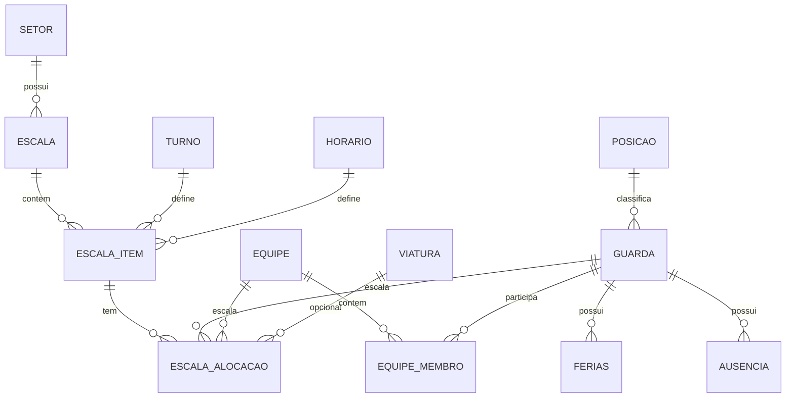

## Modelo de Dados (ERD) — Profissional (base para o sistema funcionar com cruzamentos)

Abaixo está um modelo relacional pensado para suportar:

* escala mensal **por quinzena**
* setores com regras especiais (Centrais, Rádio Patrulha, ROMU etc.)
* cruzamento (escala × férias × ausências × conflitos)
* histórico/auditoria

---

# 1) Entidades Mestre (cadastros)

## 1.1 `setor`

**Finalidade:** cadastro de setores (inclui os 51 iniciais).

Campos:

* `id` (PK)
* `nome` (UNIQUE, NOT NULL)
* `tipo` (ENUM) → `PADRAO`, `CENTRAL_COMUNICACOES`, `RADIO_PATRULHA`, `DIVISAO_RURAL`, `ROMU`, `RONDA_COMERCIO`
* `ativo` (bool)
* auditoria: `created_at`, `created_by`, `updated_at`, `updated_by`

Regras:

* `nome` único (case-insensitive recomendado)

---

## 1.2 `posicao`

* `id` (PK)
* `nome` (UNIQUE)
* `ativo`
* auditoria

---

## 1.3 `turno`

* `id` (PK)
* `nome` (UNIQUE)
* `ativo`
* auditoria

---

## 1.4 `horario`

* `id` (PK)
* `inicio` (time)
* `fim` (time)
* `descricao` (ex.: “07:30 às 12:00”)
* `ativo`
* auditoria

Obs.: permitir horários que cruzam meia-noite (ex.: 19:00–07:00). A regra de conflito usa intervalo.

---

## 1.5 `viatura`

* `id` (PK)
* `identificador` (UNIQUE) (ex.: “VTR 13400”)
* `ativo`
* auditoria

---

## 1.6 `guarda`

* `id` (PK)
* `nome` (NOT NULL)
* `telefone` (string)
* `posicao_id` (FK → `posicao.id`)
* `ativo`
* auditoria

Índice: `(nome)` para busca.

---

## 1.7 `equipe`

* `id` (PK)
* `nome` (UNIQUE)
* `ativo`
* auditoria

## 1.8 `equipe_membro`

Relaciona equipe ↔ guardas e permite vigência (opcional, mas recomendado).

* `id` (PK)
* `equipe_id` (FK → `equipe.id`)
* `guarda_id` (FK → `guarda.id`)
* `vigencia_inicio` (date, opcional)
* `vigencia_fim` (date, opcional)

Constraints:

* UNIQUE `(equipe_id, guarda_id, vigencia_inicio)` (ou sem vigência: UNIQUE `(equipe_id, guarda_id)`)
* Regra de negócio: equipe deve ter **2 a 4 membros ativos** (validada no backend).

---

# 2) Disponibilidade

## 2.1 `ferias`

* `id` (PK)
* `guarda_id` (FK → `guarda.id`)
* `data_inicio` (date)
* `data_fim` (date)
* `observacao` (opcional)
* auditoria

Constraint lógica (backend + índice):

* Proibir **sobreposição** de férias do mesmo guarda.

Índice: `(guarda_id, data_inicio, data_fim)`

---

## 2.2 `ausencia`

* `id` (PK)
* `guarda_id` (FK → `guarda.id`)
* `data_inicio` (date)
* `data_fim` (date)
* `motivo` (ENUM: `ATESTADO_MEDICO`, `DOACAO_SANGUE`, `AFASTAMENTO_JUDICIAL`, `FALTA_SEM_MOTIVO`, `OUTROS`)
* `observacoes` (opcional)
* auditoria

Constraint lógica:

* Proibir **sobreposição** de ausências do mesmo guarda.

Índice: `(guarda_id, data_inicio, data_fim)`

---

# 3) Escalas

A escala é organizada em:

* **Cabeçalho** (mês/ano/quinzena/setor)
* **Itens diários** (um dia específico)
* **Alocações** (quem/qual equipe/qual função/qual viatura)

## 3.1 `escala`

**Cabeçalho**

* `id` (PK)
* `ano` (int)
* `mes` (int 1–12)
* `quinzena` (int 1 ou 2)
* `setor_id` (FK → `setor.id`)
* `status` (ENUM: `RASCUNHO`, `PUBLICADA`, `FECHADA`) (opcional mas recomendado)
* auditoria

Constraints:

* UNIQUE `(ano, mes, quinzena, setor_id)` (evita dois “cabeçalhos” iguais)

Índices:

* `(ano, mes, quinzena)`
* `(setor_id, ano, mes, quinzena)`

---

## 3.2 `escala_item`

**Um dia dentro de um cabeçalho**

* `id` (PK)
* `escala_id` (FK → `escala.id`)
* `data` (date)
* `turno_id` (FK → `turno.id`)
* `horario_id` (FK → `horario.id`)
* `observacao` (opcional)
* auditoria

Constraints:

* `data` deve pertencer ao `mes/ano` do cabeçalho e respeitar a quinzena:

  * quinzena 1: dia 1–15
  * quinzena 2: dia 16–fim do mês
* UNIQUE `(escala_id, data, turno_id, horario_id)` (evita duplicar item idêntico)

Índice:

* `(data)`
* `(escala_id, data)`

---

## 3.3 `escala_alocacao`

**Quem está escalado em um item (guarda/equipe)**

* `id` (PK)
* `escala_item_id` (FK → `escala_item.id`)
* `guarda_id` (FK → `guarda.id`, NULLABLE)
* `equipe_id` (FK → `equipe.id`, NULLABLE)
* `funcao` (ENUM):

  * `INTEGRANTE`
  * `MOTORISTA`
  * `ENCARREGADO`
  * `APOIO`
* `viatura_id` (FK → `viatura.id`, NULLABLE)
* auditoria

Constraints importantes:

1. **XOR**: exatamente um entre `guarda_id` e `equipe_id` deve estar preenchido
   (ou seja, não pode ter ambos e não pode ter nenhum).
2. UNIQUE por item para evitar repetição:

   * se guarda: UNIQUE `(escala_item_id, guarda_id, funcao)`
   * se equipe: UNIQUE `(escala_item_id, equipe_id, funcao)`

Índices:

* `(guarda_id, escala_item_id)` (consulta rápida por guarda)
* `(equipe_id, escala_item_id)`
* `(viatura_id)`

---

# 4) Regras especiais (implementadas com validações + consultas)

As regras abaixo não precisam virar “tabela especial”; o modelo suporta via `setor.tipo` + validações no backend.

## 4.1 Setores tipo `CENTRAL_COMUNICACOES` (itens 8 e 9)

* permitir alocação por **equipe** (`escala_alocacao.equipe_id` obrigatório)
* bloquear alocação por guarda, se quiser regra rígida (ou permitir “mista”, se necessário)

## 4.2 Setores tipo `RADIO_PATRULHA` (37–45)

Para cada `escala_item` desse setor:

* deve existir:

  * 1 alocação `MOTORISTA` (guarda)
  * 1 alocação `ENCARREGADO` (guarda)
  * 1 alocação `APOIO` (preferencialmente equipe OU 2 guardas, dependendo da regra final)
* opcional: associar `viatura_id` no motorista/encarregado ou em ambos

## 4.3 `DIVISAO_RURAL`

* exige: `MOTORISTA` + `ENCARREGADO`

## 4.4 `ROMU`

* exige: `MOTORISTA` + `ENCARREGADO`
* permite 1 adicional como `INTEGRANTE`

## 4.5 `RONDA_COMERCIO`

* exige: `MOTORISTA` + `ENCARREGADO`

---

# 5) Regras de conflito (cruzamento) — como o banco ajuda

## 5.1 Conflito de escala do mesmo guarda

Regra: um guarda não pode estar escalado em dois lugares no mesmo dia com conflito de turno/horário.

Como validar:

* consulta por `escala_alocacao` (guarda_id) juntando com `escala_item` (data, turno, horario)
* comparar intervalos de horário

Recomendação (forte):

* criar uma **view** ou **materialized view** para “agenda do guarda” por dia/intervalo para relatórios e validações.

## 5.2 Escala durante férias/ausência

Validar ao inserir alocação:

* se `escala_item.data` entre `ferias.data_inicio` e `ferias.data_fim` do guarda → bloquear
* se `escala_item.data` entre `ausencia.data_inicio` e `ausencia.data_fim` → bloquear

Índices já suportam isso bem.

---

# 6) ERD em Mermaid (para documentação)

---

# 7) Restrições (constraints) que são “obrigatórias” no projeto

1. `escala`: UNIQUE `(ano, mes, quinzena, setor_id)`
2. `escala_item`: UNIQUE `(escala_id, data, turno_id, horario_id)`
3. `escala_alocacao`: XOR (`guarda_id` ou `equipe_id`)
4. `setor.nome`, `turno.nome`, `horario(inicio,fim,descricao)`, `viatura.identificador`, `equipe.nome`, `posicao.nome` com unicidade conforme definido
5. bloqueios de sobreposição: férias/ausências do mesmo guarda (validação backend + índice)

---

Se você quiser que eu feche este PRD com critérios de aceite por regra (ex.: “Rádio Patrulha só salva se existir motorista+encarregado+apoio”), eu consigo transformar as regras acima em uma tabela de critérios de aceite completa (Given/When/Then).
